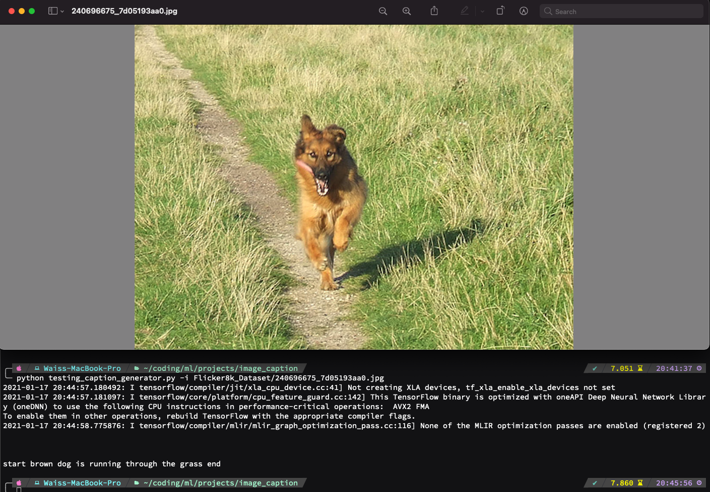
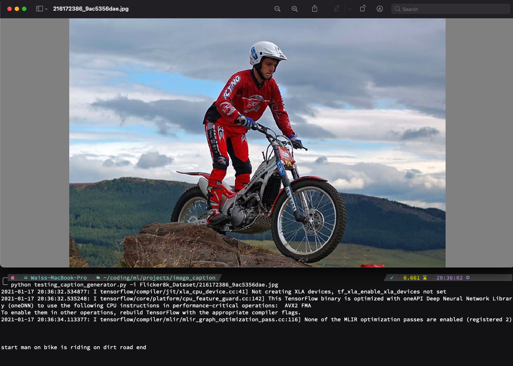
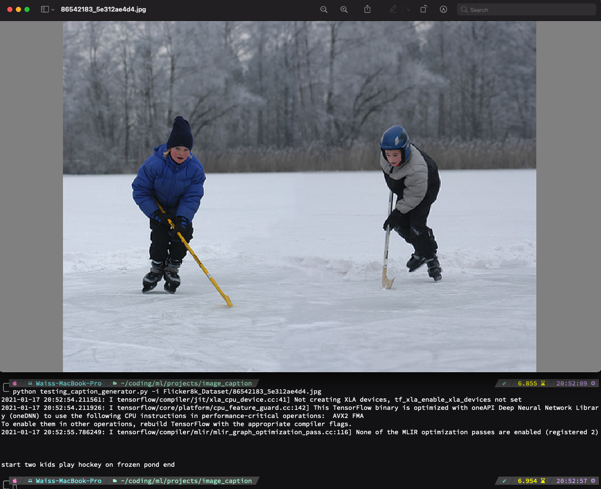

# Image Caption Generator

Image caption generator model built as a CNN-RNN model, where we use the pretrained Xception model for our CNN component and LSTM for our RNN component.

The datasets used are the Flickr_8k dataset, a subset of the Flickr_30k dataset, containing 8 thousand images. The data is preprocessed into a set of images and captions, (each images maps to 5 captions), and the text is normalized (remove punctuation, all lower case, remove numbers, etc), and stored in file `descriptions.txt`. The feature vectors are then extracted from all images using the Xception model and stored in pickle file `features.p`. The training dataset, `Flickr_8k.trainImages.txt` file is preprocessed to create a dictionary with cleaned descriptions and added `<start>` and `<end>` tokens so the LSTM model can identify the start and end of each caption. Using Keras, each word in the vocabulary is tokenized and saved in pickle file `tokenizer.p`. After writing a data generator to yield input and output sequences, we defined our CNN-RNN model. The model was trained using the data generator to generate bactches and fitting using `model.fit_generator()`. The model is saved within the `models` directory.

The model can be tested by exectuting from the terminal `python testing_caption_generator.py -i Flicker8k_Dataset/your_image` where `your_image` is the name of the image in the Flicker8k_Dataset folder in the repo.

## CNN-RNN model definition

The Keras model from the Functional API was used to define the model. The model consists of 3 major components:

* **Feature Extractor** - features extracted from images have size 2048. Using a dense layer, we reduce the dimension to 256 nodes.
* **Sequence Processor** - embedding layer handles textual input, followed by LSTM layer
* **Decoder** - Merge the outputs from the 2 above layers, process with a dense layer to make final prediction. Final layer contains number of nodes equal to vocabulary size.

## Examples

